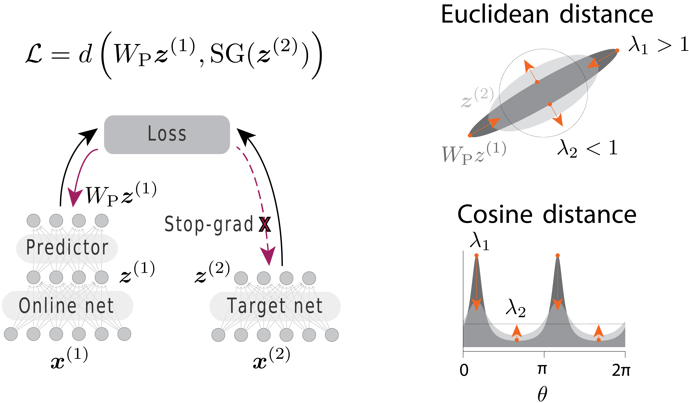

# Implicit variance regularization in non-contrastive SSL
This repository contains code for reproducing results reported in our [paper](https://neurips.cc/virtual/2023/poster/69901) describing how asymmetric non-contrastive SSL methods like BYOL perform *implicit* variance regularization.
The code here is heavily based on [solo-learn](https://github.com/vturrisi/solo-learn), a library of self-supervised methods.
As such, most of the functionality of solo-learn is available here as well.



## Methods available
* [BYOL](https://arxiv.org/abs/2006.07733)
* [DirectPred](https://arxiv.org/abs/2102.06810)
* [DirectCopy](https://arxiv.org/abs/2110.04947)
* [IsoLoss](https://neurips.cc/virtual/2023/poster/69901)


## Installation

First clone the repo.
If no Dali support is needed, the requirements can be installed in a virtual environment with:
```
pip3 install -r requirements.txt
```
If you want to use Dali, you need to install it manually following their [guide](https://github.com/NVIDIA/DALI).


## Training

For pretraining the backbone, follow one of the many bash commands in `run_experiments.sh`, with most of the hyperparameter set in `scripts/pretrain/` following the exact same structure as solo-learn.
The common syntax is something like:
```bash
python3 main_pretrain.py \
    # path to training script folder
    --config-path scripts/pretrain/cifar/ \
    # training config name
    --config-name isoloss.yaml
    # add new arguments (e.g. those not defined in the yaml files)
    # by doing ++new_argument=VALUE
    # pytorch lightning's arguments can be added here as well.
```

For DirectCopy, just run DirectPred with the `dp_alpha` parameter set to 1, and the `eps_iso` parameter set to 0.25, and similarly for the IsoLoss version.

In the paper, we report online readout accuracy, which is logged by wandb, and can be extracted from the logs as needed.


<!-- ## Citation
```bibtex
@article{JMLR:v23:21-1155,
  author  = {Victor Guilherme Turrisi da Costa and Enrico Fini and Moin Nabi and Nicu Sebe and Elisa Ricci},
  title   = {solo-learn: A Library of Self-supervised Methods for Visual Representation Learning},
  journal = {Journal of Machine Learning Research},
  year    = {2022},
  volume  = {23},
  number  = {56},
  pages   = {1-6},
  url     = {http://jmlr.org/papers/v23/21-1155.html}
}
``` -->
